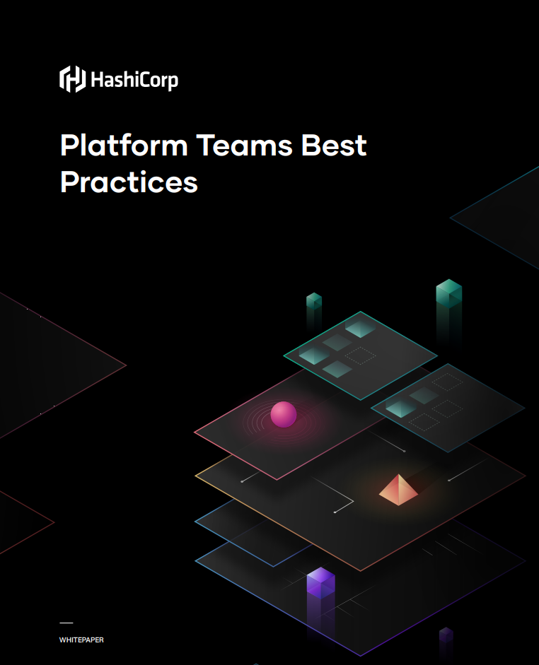
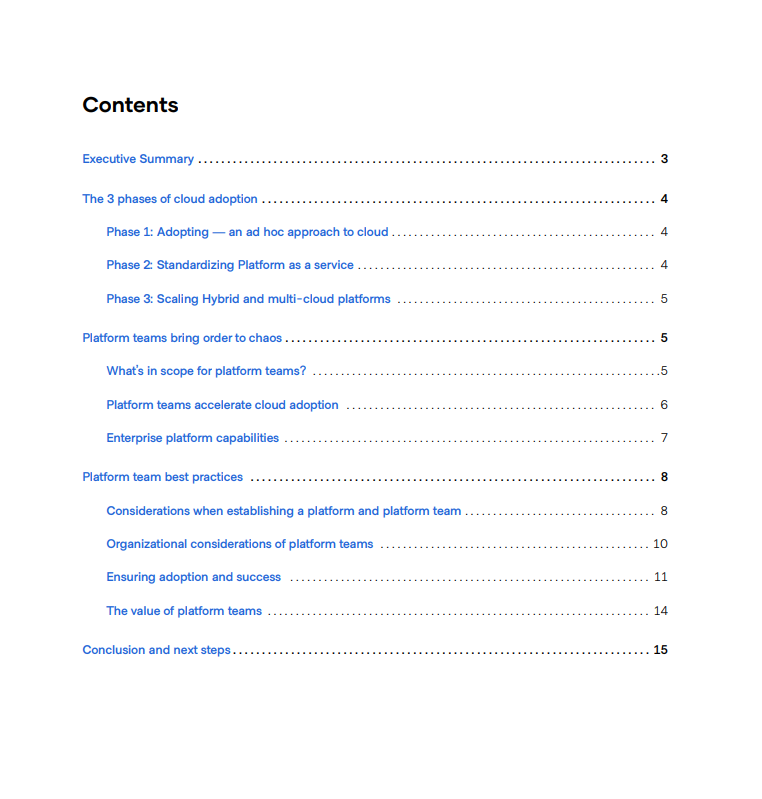

HashiCorp近期发布了一份平台工程相关的白皮书：《Platform Teams Best Practices》，旨在帮助开发人员了解上云的各个阶段、平台团队所扮演的角色，以及如何建立和确保这些团队及其创建的平台能够成功。

原文：https://www.hashicorp.com/resources/platform-teams-best-practices

## 1 摘要

采用云技术需要一种新的运营模式，将您的云基础设施和工具从多样化的临时部署转变为一个统一的中央平台，为您的云产业的所有四个层面（基础设施、安全、网络和应用）提供一致性。为了降低成本、减少风险并提高开发和部署速度，企业会求助于集中式平台工程团队来构建和启用共享服务。

根据企业的不同，这些平台团队可能被称为云团队、DevOps 团队、SRE 团队或其他名称。无论名称如何，他们的任务都是通过云中的标准化共享服务为企业的不同应用团队（即客户）提供支持。这有助于企业实现更大的数字化转型目标，即加快新业务和客户价值的大规模交付。平台团队的任务是在企业内部构建和部署标准化的云工具和系统，这与软件平台的开发和管理方式非常相似。对于每个云层，目标都是建立一套一致的标准化共享工作流程和服务，使其成为开发团队的参与系统。

平台团队通常由云工程师组成，负责按照云运营模型的蓝图实施平台。成功采用云运营模型需要从一开始就正确组建和定义团队及其创建的平台。团队需要对他们正在构建的平台的目标以及平台部署后持续发挥的作用有明确的授权。

本文重点介绍云采用的各个阶段、平台团队所扮演的角色，以及如何建立和确保这些团队及其创建的平台的成功。

## 2 采用云技术的三个阶段

第 1 阶段：采用 —— 一种临时的云方法

第 2 阶段：标准化 —— 平台即服务

第 3 阶段：扩展 —— 混合云和多云平台

## 3 平台团队为混乱带来秩序 

### 平台团队的职责范围是什么？

平台团队有责任为应用程序团队提供一致的解决方案。平台团队还必须确定如何最好地向大众提供平台及其功能。应用程序团队希望专注于开发应用程序，而不是底层的云基础设施。通过提供尽可能多的服务，开发团队可以轻松部署支持应用程序所需的工具和功能，而不必担心其他一切。

### 平台团队加速云采用

除了提供标准化的共享服务外，平台团队还：
（1 为开发人员建立使用云服务的通用最佳实践集。然后，他们将这些最佳实践编入工作流程和教育计划（例如卓越云中心）中。
（2 作为其他公司团队（例如安全、合规、财务控制等）的单点集成，以确保最佳实践融入相关工作流程中。
（3 将平台集成为产品实践，以确保平台的持续开发。双向沟通有助于将组织及其开发团队的持续需求迭代到更大的平台中。
（4 创建一个用于跟踪、报告和审核的中央系统，以提供云运营模型的采用和使用情况的可见性。这使组织能够深入了解平台的进展，并可以突出显示安全性、合规性和支出方面的风险。

### 企业平台能力

## 4 平台团队最佳实践

### 建立平台和平台团队时的考虑因素
了解客户
从一开始就定义和衡量可靠性
建立安全性和合规性
使用成熟度模型来告知投资路线图

### 平台团队的组织考虑
创建正式的平台团队结构
提供愉快的开发者体验
通过宣传建立内部社区

### 确保平台的采用和成功
不断减少劳力并提高自动化程度
实现自助服务和自我主导的教育，以鼓励平台采用
通过显示退款和扣款优化成本
评估平台的成功
使目标与业务目标和成果保持一致

### 平台团队的价值
提高效率降低成本
降低风险
加快开发

## 5 下载

白皮书PDF版本下载地址 

https://www.datocms-assets.com/2885/1696970641-hashicorp_whitepaper_platformteamsbestpracticeswhitepaper_q3-23_v2.pdf 

---- 
**加入 PECommunity平台工程社区，获取更多最新动态！**

如果你有不错的平台工程相关主题原创内容，欢迎投稿！ 关注公众号 **@平台工程洞察**
