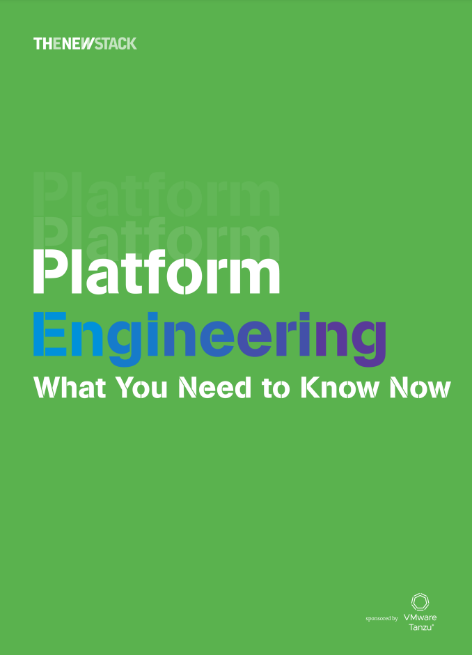
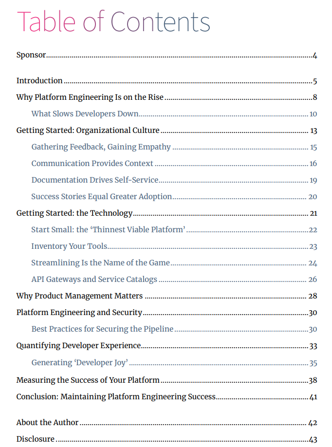

平台工程指南：TheNewStack 发布电子书

TheNewStack日前发布了免费电子书《Platform Engineering: What You Need to Know Now》，该电子书由 VMware Tanzu 赞助，期望为您的平台工程战略奠定基础，助您实现 DevOps 所承诺的更快的生产力。

通过这本平台工程的新电子书，探索 DevOps 文化如何导致内部开发者平台的采用率上升。

## 新电子书内幕——平台工程指南

这本免费电子书由 VMware Tanzu 赞助，为您的平台策略奠定基础。它汇集了数十家经历过这一旅程的组织的建议和经验，因此您可以与内部开发者客户建立同理心和理解力，并构建一个内部开发者平台，真正帮助他们以更少投入、更快速度实现更多目标。

通过本平台工程指南，您将了解：

-   为什么平台工程正在兴起。
-   如何注重文化先行。
-   如何建设一个“最薄可行平台”来帮助你的开发者快速上手。
-   API 和自服务的力量。
-   平台即产品思维。
-   平台赋能安全性。
-   度量平台的成功。
-   如何保持势头。

这本平台工程的电子书适合各种规模的组织，希望以真正理解和响应开发者需求的方式创建或扩展其平台策略，从而提高开发者的工作效率和乐趣。

## 全书目录

  
## 免费下载

**PDF版本免费下载链接   
**https://dl.thenewstack.io/ebooks/series12/TheNewStack_PlatformEngineering_WhatYouNeedtoKnowNow.pdf

原文链接  
https://thenewstack.io/ebooks/platform-engineering/platform-engineering-what-you-need-to-know-now/

* * *

**加入 PECommunity平台工程社区，获取更多最新动态！**  

如果你有不错的平台工程相关主题原创内容，欢迎投稿！
