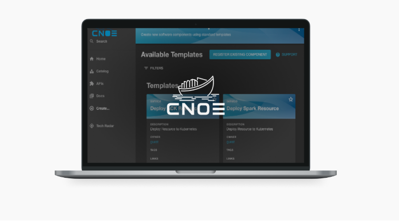

# CNOE：构建内部开发者平台IDP的开源参考框架

Adobe、Amazon Web Services、Autodesk、Salesforce 和 Twilio 联合推出了一项用于构建内部开发者平台 (IDP) 的开源计划——云原生卓越运营（又名 CNOE，发音为 Kuh.noo）是一项共享开发者工具、想法和模式的共同努力，以帮助组织做出明智的技术选择并解决常见的痛点。 

CNOE : Cloud Native Operational Excellence   云原生卓越运营

官网 https://cnoe.io

## 平台架构

## 概述

采用 OSS 作为云平台基础的企业面临着选择能够支持其业务成果 3-5 年的技术的挑战。大型组织的重组和重组平台成本很高，这使得对特定技术的押注成为其技术战略的基础。为了降低这些赌注的风险，企业会考虑同行组织的投资。 

CNOE 框架的目标是将一群同等规模的企业聚集在一起，以便他们能够共同制定运营技术决策，降低工具风险，协调贡献，并为使用 CNCF 技术的大型企业提供指导一起使用以实现最佳的云效率。

CNOE 社区将共同引导他们的运营技术决策，协调贡献，并就使用哪些云原生计算基金会 (CNCF) 技术来实现云效率提供指导。CNOE 将致力于：

1. 为内部开发人者平台能力创建开源优先战略，优先考虑 CNCF 技术。
2. 建立社区在技术选择和最佳实践方面的一致性。
3. 提升工具和实践，使建立自己内部开发者平台的众多组织受益。
4. 为基础架构而建，并根据开发人员的需求进行定制，使解决方案和模式可灵活采用。
5. 提供有关工具、模式和实践的人工制品，方便社区使用。

## 路径

CNOE 采用多群体和公共方法来解决 DevOps 团队面临的问题。为了解决 CNCF DevOps 工具分散且复杂的生态系统中的选择挑战，CNOE 寻求社区就根据用户规模和规模对交付需求进行分类细分达成共识。这涉及到根据用户群体的看法并根据公司规模、运营性质和工作负载类型来定义成功的 DevOps 策略所必需的工具类别。然后，CNOE 在每个类别中认可一组工具，将这些工具配置在一起时，可以提供顶级的 DevOps 体验。

- 可插拔性和可扩展性
- 由 Kubernetes 支持，但不限于 Kubernetes
- 构建模式和工具

**角色**

- 应用开发者
- 包构建者
- 基础设施运营商
- 信息安全工程师（ISE）

## 技术能力

- Artifact Registries  制品注册
- Packaging and Templating 打包和模板化
- Code Repositories 代码仓
- Config Repositories 配置仓
- Secret Repositories 密钥仓
- Signing 签署
- Developer Portal 开发者门户
- Identity and Access  身份识别和访问
- Infrastructure as Code (IaC) 基础设施即代码
- Continuous Delivery (CD) 持续交付
- Workflow Orchestration 工作流编排
- Service Discovery 服务发现
- Secret Management 密钥管理
- Validation 验证
- Compute Platform 计算平台
- Observability 可观测性
- Deployment Targets 部署对象

## 参考实现

每个组织对其内部开发者平台 (IDP) 的要求都略有不同，因此为 IDP 设计全面的解决方案既不合理也不可能。

尽管 IDP 存在差异，但各组织都有共同的工具、模式和做法。

虽然在如何使用 IDP 现有能力中的不同工具方面存在共识，但在如何配置和组合这些工具以高效提供所需的平台工程实践方面，几乎没有任何参考资料。

CNOE 的目标是收集平台工程师设计 IDP 时常用的工具、这些工具的配置方式以及可在各组织间扩展和使用的通用模式和实践的实现方法，并提供相关参考。

CNOE 绝非试图做到面面俱到，而是旨在收集社区驱动的模式和基于生产中常用部署的最佳实践。

对于 CNOE 参考实现，我们将提供配置、模式和实践以及以下（不断增长的）技术列表。

|Capability 能力 |	Technologies 技术 |
|----------------|-------------------| 
|Code Repository	| Git |
|Config Repository	| Git |
|Artifact Registry	| Container Registries |
|Secret Repository	| External Secrets (with Vault and KMS) |
|Validations	| CNOE Validators |
|Secret Management	| External Secrets |
|Infra as Code	| Terraform, Crossplane |
|Continuous Delivery	| Argo CD, Flux |
|Continuous Integrations	| Argo Workflows, Tekton |
|Identity & Access	| KeyCloak |
|Developer Portals	| Backstage |

## 技术雷达

### 运维视角

### 应用视角

我们希望在平台工程持续火热的当下，CNOE为你带来全新的其实并提供具有实践指导意义的框架参考。

CNOE官方文档 https://cnoe.io/docs/intro

加入 PECommunity平台工程社区，获取更多动态！  https://pecommunity.cn   欢迎投稿！
