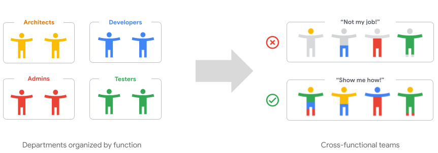
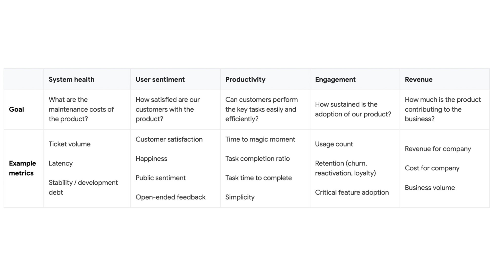

# 应用现代化趋势：您的平台工程项目注定失败吗？ ②

最近，我的同事 [Richard Seroter](https://www.linkedin.com/in/seroter) 在 The Modernization Imperative（TMI）中分享了[下移而非左移](https://cloud.google.com/blog/products/application-development/richard-seroter-on-shifting-down-vs-shifting-left)的观点--利用预建平台减轻开发和运维人员的负担。我的工作是为工程领导者提供云计算现代化建议，从这个角度上来说，我是拥护这一观点的。但是，如果您的企业正在构建自己的平台（以及平台工程团队），在开始之前，我建议先问自己几个问题，否则你的平台就会一败涂地。

内部技术平台已成为当下的流行趋势，这事出有因：平台在保持集中管理能力和安全性的基础之上，让 IT 专家能够更独立地高效工作。云本身不仅是一个平台，它还提供了在其之上开发其他内部平台的绝佳机会，例如：[BigQuery](https://cloud.google.com/bigquery) 数据平台、[Vertex AI](https://cloud.google.com/vertex-ai) ML/AI 平台、[Apigee API 管理平台](https://cloud.google.com/apigee)或 [Google Kubernetes Engine](https://cloud.google.com/kubernetes-engine) 多租户容器运行时平台。

对于首席信息官或企业架构师来说，投资平台的战略重要性似乎显而易见。但是问题在于，有人关心你的平台吗？你的平台有人用吗？

你当然可以强迫别人使用你的平台，这种做法的结果，可能是喜忧掺半：虽然获得了集中管理和安全能力；但也会让用户望而却步——新的平台强迫他们重新学习、重新工具化和平台化他们（主观上）没有要求甚至不需要的东西，还没开始之前，用户可能就已经有了抵触心理；使用平台的体验如果不够完美，那么平台和平台团队就会受到责难。

你能鼓励采用，甚至大张旗鼓地拥抱吗？新的内部平台总是注定要失败吗？幸好不是。

要想取得成功，就需要澄清三个基本问题：平台为谁而建？谁来建设平台？最后但同样重要的是，如何度量平台？

## 问题 1：平台为谁而建？

我们都听过“从用户需求出发，以终为始”的建议。然而在大企业中，识别用户需求是有难度的。内部平台的实际用户是另一个部门的员工，但他们的需求往往是由部门主管或产品负责人来代表的；这些主管或者负责人，可能会与“X 平台负责人”进行交流，后者会确定需求的优先级，并委托架构师进行设计，后者又会指导平台工程师如何构建...你的用户到底需要什么呢？

建议做法：平台工程师应该定期与实际用户及其产品经理面对面交流。参与创建或使用平台的每个人都需要挤在一个房间里，或者至少可以在 Meet/Zoom/Teams 屏幕上可见。如果平台的用户是自己，那么就不存在供需矛盾，因此最好的平台往往是为自己建立的平台。

如果您无法将所有利益相关者召集到同一房间，您可以使用一个强大的工具来弥合这一差距：用户观摩会。用户观摩会相当于一个焦点小组，将你的工程师聚集在一起，通过单面镜观察隔壁房间的用户与平台的互动。实际上，你只需录制他们的电脑屏幕和声音（当然要征得他们的同意）。招募五名测试用户，给他们同样的两三个目标，让他们分别使用你要取代的传统平台，以及你正在构建的新平台的 MVP 版本来完成。让他们畅所欲言，说出自己的假设和可能遇到的困惑。

你会惊奇地发现，即使是最聪明、最精明的测试用户，他们所花的时间也比你想象的要长，而且会卡在你认为不可能卡住的地方。你也许会把这些轶事当作异常现象，或者认为更清晰的文档和更多的培训就能包治百病，但实际上，你正在目睹一个新平台所面临的真正挑战：需要取悦用户，让他们的工作生活更轻松。

用户观摩会还有一个好处，就是可以调整工程团队内部的优先级，因为平台团队成员都亲眼目睹了同样的事情。在此之前，每个团队成员可能都会希望优先实现自己最喜欢的功能；而现在，平台团队应该聚焦于哪一个功能，已经一目了然。

## 问题 2：谁来建设平台？

知易行难，应该以自我批判的态度来对待平台工程的建设问题。通常是平台团队提出建设思路的，落地过程一定会是一块难啃的硬骨头。但是在建设过程中仍要注意：这艰巨任务与你、你的平台工程师、你的平台主管或你的首席信息官都无关，而是与你的用户有关。平台团队首先要满足用户的需求，其次才轮到实现个人抱负。

接下来，平台团队应该是什么样的团队？简而言之，理想的平台团队应该是专注、小规模和跨职能的。让三位工程师全职负责新平台，总比让十个人在日常工作之余还忙于开发新平台要好。除了专门的实现团队之外，还需要有强有力的执行赞助人，以便在团队发展的初级阶段为其提供空中优势。每家数字原生公司都是这样建立内部平台的，你也必须如此。

平台的构建过程中更多的挑战来自于学习，而非执行。快速反馈回路和共享学习对于团队的成功至关重要。只有团队成员相互靠近（物理上或虚拟上），并尽量减少对其他团队的依赖时，才能取得成功。为了避免“不是我的工作”的陷阱，即每个人只接受符合其专长或工作要求的工作，这种紧密的关系也是必不可少的。共同的“告诉我怎么做”心态允许团队默认各自的主题专家（SME），但希望团队中的每个人都有能力解决任何技术难题。

最后，平台团队是否有可能需要获得许可才能使用某些服务，例如 CISO 或您的企业架构师？如果是这样，让他们（或他们的代表之一）成为团队的核心成员，直到他们的贡献以策略代码和架构蓝图的形式融入平台。

## 问题 3：如何度量平台？

一个平台即使能够按计划、按时、按预算交付，但却没有被广泛采用，那就成了无用功。为了避免出现这种情况，不要用这类项目关键绩效指标来衡量平台团队的成功与否。取而代之的是产品关键绩效指标，用于衡量平台的实用性、采用率和用户满意度。

衡量软件产品成功与否并没有唯一正确的方法，但成功回答这三个问题则表明了软件产品的进步：

1. 用户实现目标需要多长时间？（少 = 好）
1. 有多少用户使用该平台，使用频率如何？（越多越好）
1. 用户的满意度如何，以及他们向其他员工推荐该平台的可能性有多大？

在谷歌，我们喜欢在许多面向消费者的产品中使用 **H.E.A.R.T.** 框架。我们还在一些内部 IT 平台上使用一个经过修改的框架，我们称之为 **S.U.P.E.R.**：

## 找到你的用户

我们解释了为什么在构建平台时，贴近内部用户是最重要的，我们还展示了如何通过促进用户观摩会来拉进和用户的关系。我们还强调了创建专门、小型、跨职能团队的重要性，以及如何激励他们建立一个令人信服的平台，让员工的工作生活变得更轻松，而不仅仅是在完成一个 IT 项目后再去做下一个项目。

我们仅仅讨论了成功规划、构建和运营一个引人注目的平台产品的表面。关于用户角色的重要性、用户旅程映射以及产品经理的真正角色，我们还可以说得更多。

如果你能从这篇文章中得到一点启发，那就是：你不知道你的用户需要什么、想要什么。你只有假设，需要被证明或推翻的假设。用户不会自发的使用你的平台。你必须去为平台找到用户。
