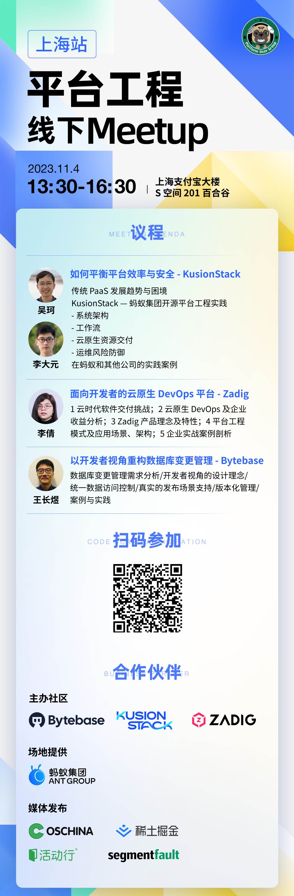

## 活动预告｜平台工程 11.4 线下 Meetup · 上海

🚀 本周六下午，Platform User Group 将举行成立后第二次线下 Meetup，嘉宾来自：

- 蚂蚁集团 PaaS 核心团队云原生运维负责人吴珂 & 云原生应用运维平台建设负责人李大元
- KodeRover 创始人兼 CEO，Zadig 开源作者李倩
- Bytebase 解决方案和商业化负责人王长煜

活动限量 50 人，详情见下图，欢迎大家扫描图中二维码报名！

⏰ 2023.11.04（本周六）下午 13:30 - 16:30

📍上海市浦东新区南泉北路 447 号支付宝大楼 S 空间 201 百合谷

关于 Platform User Group (PUG) https://pug.fyi/ 

Platform User Group 是一个自发组织的兴趣小组，旨在推动平台工程 Platform Engineering / 开源 Infra 在中国的发展。

