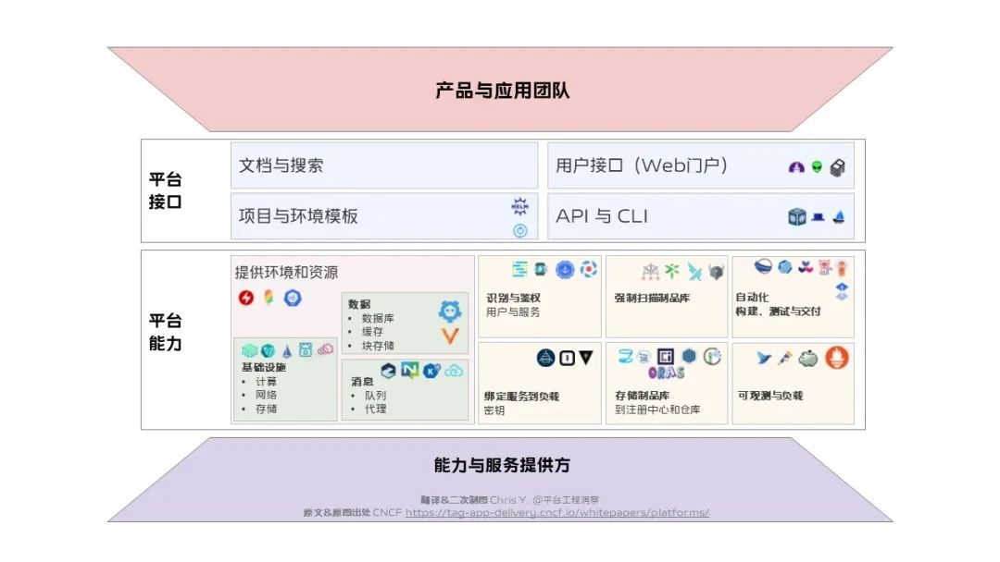

## 新闻速递｜平台工程首次线下 Meetup 回顾（内附 PPT + 视频）

[平台工程用户组（PUG）首次线下 Meetup 回顾](https://mp.weixin.qq.com/s/NN7KUe2_jOeAtU949Yy6DA)

平台工程持续发展，线上线下活动逐步开启了，值得关注和参与。

## 新闻速递｜2023 平台工程技术峰会：AIGC 时代下的平台工程

[平台工程技术峰会-活动行](https://www.huodongxing.com/event/3709735698300 "平台工程技术峰会-活动行")

国内平台工程主题的首次技术峰会，9月在北京进行，值得关注。

## 新闻速递｜CNCF 旗舰会议 KubeCon + CloudNativeCon + Open Source Summit China 2023 设置「平台工程」主题

[KubeCon + Cloud Native Con + Open Source Summit](https://www.lfasiallc.com/kubecon-cloudnativecon-open-source-summit-china/ "KubeCon + Cloud Native Con + Open Source Summit")

本次会议将于 2023-9-26~28 在上海进行，CFP 投稿 6 月已结束，CFP 通知 7 月底完成（目前仍在最后评审中），8 月 2 日公布议程。

CFP 页面对于平台工程主题的介绍：
平台工程 – 这些内容涵盖使用云原生项目构建平台、定制和扩展云原生项目、自动化基础设施运营、提高自助工具链和云原生开发者工作流程的速度等方面。参与者可以学习开发者平台和集成，以改善云原生开发体验。平台工程旨在专注于支持 SDLC 的基础组件。

## 业界动态｜CNCF 发布的「平台白皮书」现已有中文版本可读 

* [Platform White Paper（英文版）](https://tag-app-delivery.cncf.io/whitepapers/platforms/ "Platform White Paper（英文版）")
* [平台白皮书（中文版，@JimmySong 译）](https://tag-app-delivery.cncf.io/whitepapers/platforms/ "平台白皮书（中文版，@JimmySong 译）")

CNCF 应用交付 TAG & 平台 WG 发布的这份儿白皮书以平台为核心视角，并不局限平台工程本身，涉及为何需要平台，什么是平台，以及平台成熟度，平台接口，平台能力，平台挑战等，希望可以带来更多的启发。

## 业界动态｜CNCF 的应用交付 TAG 正在起草「平台成熟度模型」

[平台成熟度模型 - CNCF TAG Delivery](https://community.cncf.io/events/details/cncf-tag-app-delivery-presents-platform-maturity-model-deep-dive-take-2/ "平台成熟度模型 - CNCF TAG Delivery")

如何度量平台工程？CNCF 应用交付 TAG 在此前发布平台白皮书之后，目前正在讨论起草平台成熟度模型，值得关注。此前，CNCF 也发布了[云原生成熟度模型](https://maturitymodel.cncf.io/ "云原生成熟度模型")，看来在度量这件事上，人们始终是很热衷的，有一种急切地想要体现价值的感受。

## 业界动态｜Platform Engineering 社区发布平台工具全景图 

[平台工具全景图](https://platformengineering.org/platform-tooling "平台工具全景图")

提供了基于现有工具构建自己的内部开发者平台的工具集合指南，分类如下：

- 开发者控制面板：开发者门户/服务目录，IaC
- 集成与交付面：CI, 注册中心，协调器，CD，基础设施控制面
- 资源面：集群，数据，网络，服务-消息
- 监控与日志面：可观测性，分析，APM
- 安全面
- 其他：环境即服务，DevOps平台
