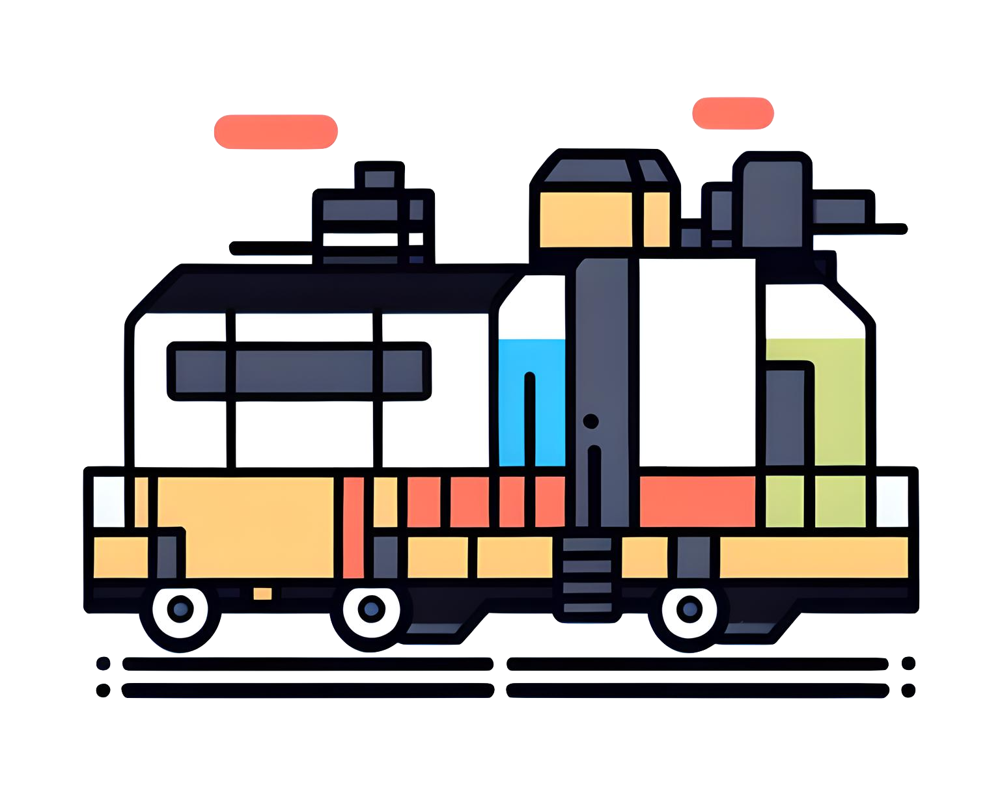

import Hero from '../components/Hero'
// import Carousel from '../components/Carousel'

    {/* <Carousel /> */}
    <Hero 
        title='平台工程社区'
        description='中立的，非商业目的，以开放协作为中心的中文技术社区'
        buttons={[
            {
                title: '查看知识地图',
                link: '/mindmap',
                type: 'primary'
            },
            {
                title: '浏览推荐职位',
                link: '/jobs',
                type: 'neutral'
            }
        ]}
    >
        
    </Hero>

