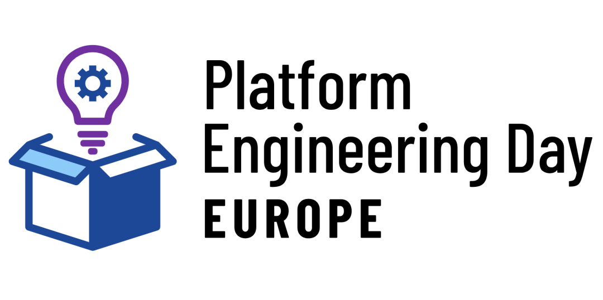

# Platform Engineering Day议程公布 KubeCon + CloudNativeCon Europe 2024

CNCF-hosted Co-located Events Europe 2024
Platform Engineering Day
Tuesday, March 19

CNCF主办的同场活动 平台工程日 

## 议程详情

09:00 CET
Platform Engineering Day: Welcome + Opening Remarks

09:15 CET
Sometimes, Lipstick Is Exactly What a Pig Needs! - Abby Bangser, Syntasso & Whitney Lee, VMware

09:50 CET
Beyond Platform Thinking at Ritchie Brothers - Build Things No One Expects, in a Place No One Expect - Bryan Oliver, Thoughtworks

10:20 CET
Platform Engineering Day: Sponsored Keynote - Bassam Tabbara, Upbound

10:30 CET
⚡ Lightning Talk: Blueprints of Innovation: Engineering Paved Paths for a User-Friendly Developer Platform -Ahmed Benbars, The New York TImes

10:40 CET
⚡Lightning Talk: How Did We Get Here? Why You Need Platform Engineering - Ettie Eyre, Ovo Energy

11:05 CET
Building a Platform Engineering API Layer with kcp - Marvin Beckers, Kubermatic GmbH

11:40 CET
Panel: The Platform Rock-Paper-Scissors: Build, Adopt, Buy - Jorge Lainfiesta, Independent Contributor; Leena Mooneeram, Chainalysis; Victor Araujo, Wolt; Jinhong Brejnholt, Saxo Bank; Edgaras Petovradžius, LEGO...

12:20 CET
⚡ Lightning Talk: Breaking the Mold: Unveiling Anti-Architectural Patterns in Platform as a Product - Vamshi Krishna Samudrala, American Airlines

12:30 CET
⚡ Lightning Talk: Empowering Giants: Guide Your Enterprise with CNOE in Operational Tech Choices - Engin Diri, Pulumi

13:30 CET
Designing for Success: UX Principles for Internal Developer Platforms - Kirsten Schwarzer, Octopus Deploy

14:05 CET
Boosting Developer Platform Teams with Product Thinking - Samantha Coffman, Spotify

14:40 CET
Building an AI-Powered, Paved Road Platform with Cloud-Native OSS - Todd Ekenstam & Avni Sharma, Intuit

15:15 CET
Unlocking Innovation: How NatWest Bank Uses Cloud Native Tools to Deliver Platform as a Product - Chris Plank, Natwest Group & Derik Evangelista, Syntasso

15:50 CET
To K8S and Beyond – Maturing Your Platform Engineering Initiative - Nicki Watt, OpenCredo

16:25 CET
Panel: Navigating the Path to Platform Engineering Excellence: A Comprehensive Guide - Cortney Nickerson, Kubeshop; William Rizzo, SUSE; Abby Bangser, Syntasso; Areti Panou, SAP SE; Charity Majors, Honeycomb

17:00 CET
Platform Engineering Day: Closing Remarks

## 相关链接 

1. Platform Engineering Day https://colocatedeventseu2024.sched.com/overview/type/Platform+Engineering+Day

2. 同场活动概览 https://events.linuxfoundation.org/kubecon-cloudnativecon-europe/co-located-events/cncf-hosted-co-located-events-overview/

3. 全部同场活动的完整议程 https://colocatedeventseu2024.sched.com/ 

4. 大会官网 https://events.linuxfoundation.org/kubecon-cloudnativecon-europe/ 

